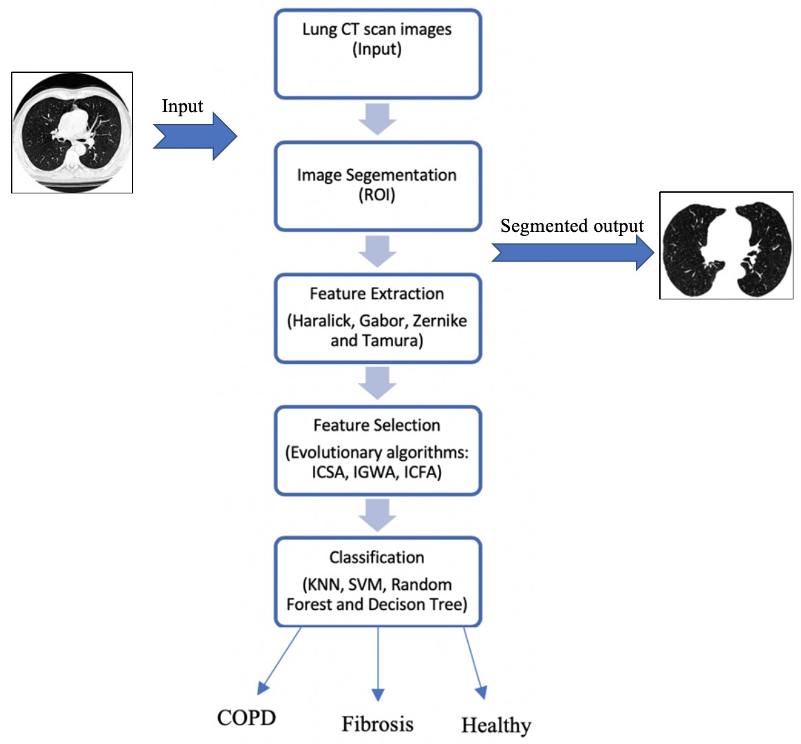
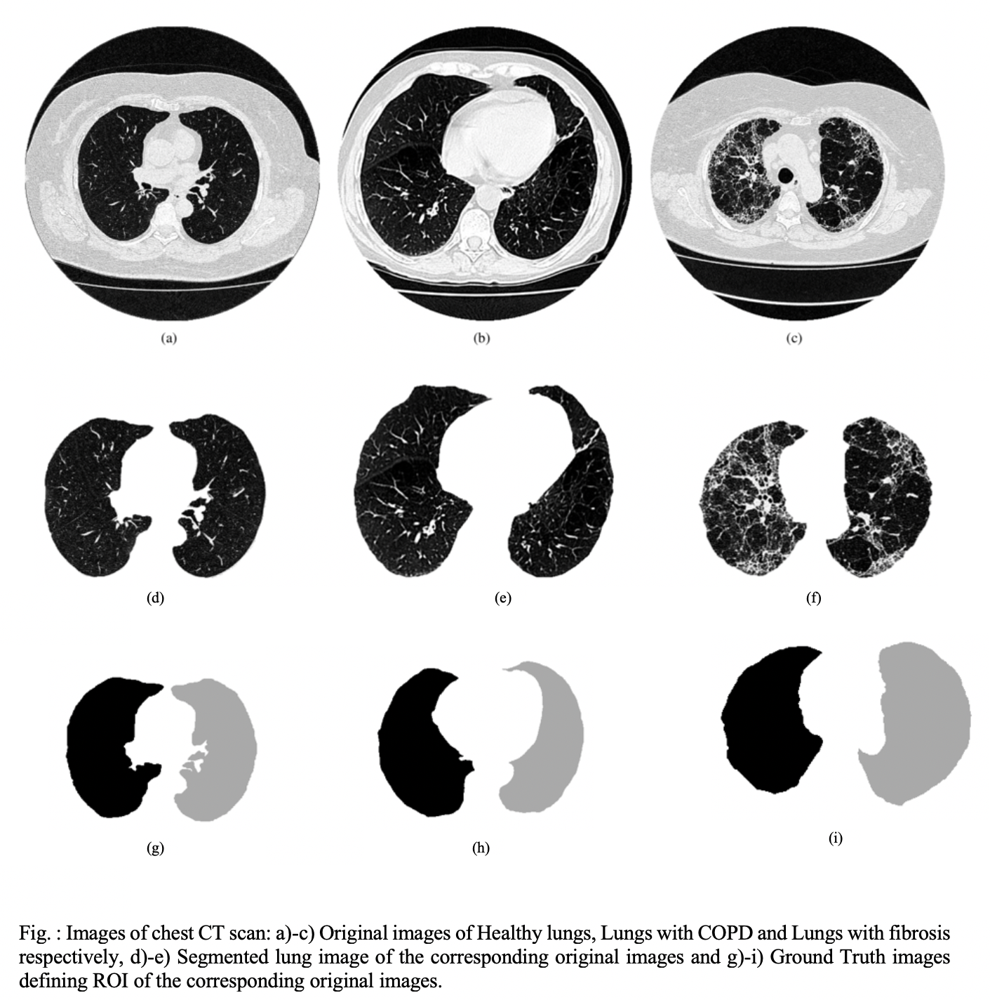
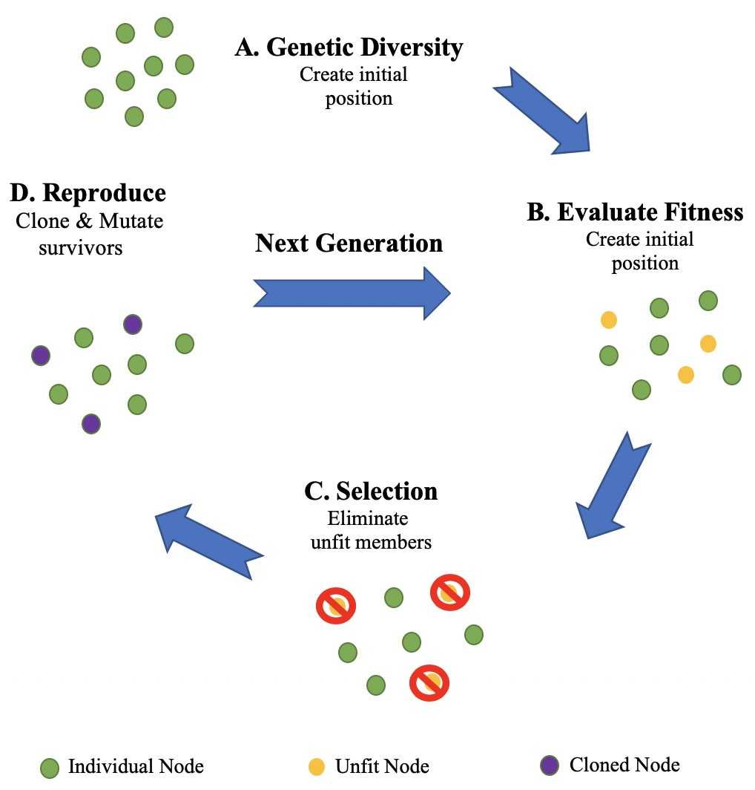

# Image-Processing-Lung-disease-detection-using-feature-selection-and-machine-learning
A Computer Aided Diagnosis (CAD) system to diagnose lung diseases: COPD and Pulmonary Fibrosis using chest CT images.
  - Image segmentation was done by getting active contour and creating binary mask image.
  - Features extracted are : Zenrike, Haralick, Gabor and Tamura (total 111 image descriptors)
  - Bio-inspired evolutionary algorithms : Crow Search, Grey Wolf and Cuttlefish algorithms were used for feature selection.
  - Classifiers used : SVM (Linear kernel), KNN, Random forest and Decision tree.
  - 99.4% accuracy achieved.
  
  
### Dataset:
The dataset was acquired in collaboration with the Walter Cantídio University Hospital, Fortaleza, Brazil. The following CT systems were used for obtaining the dataset: Toshiba Aquilion (TA), GE Medical system LightSpeed16 (GEMSL) and Phillips Brilliance 10 (PB) and the axial tomographic planes were used. In this study, 36 chest CT images were used out of which 12 CT images were from healthy volunteers, 24 CT images were from patients: 12 patients with pulmonary emphysema and 12 patients with fibrosis. In total, 72 lungs were considered and studied in this work.
 
#### For more details, please refer to the published paper:
Naman Gupta, Deepak Gupta, Ashish Khanna, Pedro Rebouças Filho, Victor Hugo C. de Albuquerque, “Evolutionary Algorithms for Automatic Lung Disease Detection”, Measurement (Elsevier), doi:https://doi.org/10.1016/j.measurement.2019.02.042, 2019.

### Proposed CAD System:

### Lung Segmentation:

### Feature Selection - Evolutionary Algorithm cycle:

